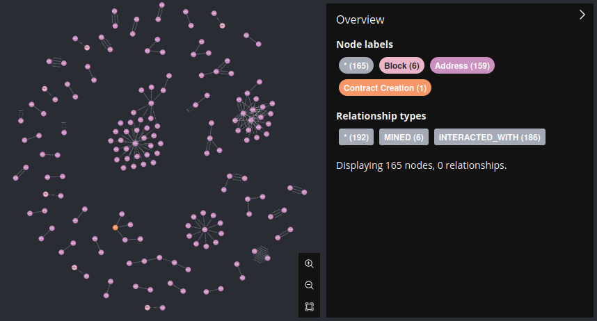
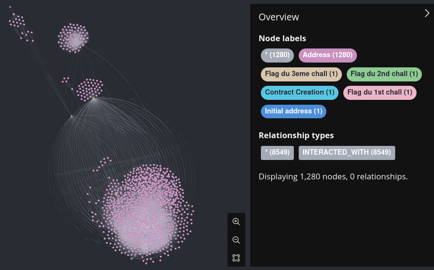

# graph-blockren

A etherum transaction vizualiser (probably useful for ctf's/regular web3 osint i guess)

## Installing

```bash
$ docker run \
    --publish=7474:7474 --publish=7687:7687 \
    --volume=$HOME/.neo4j/data:/data \
    -d neo4j
$ pip3 install -r requirements.txt
```

ps: After launching the neo4j database, change it's password in the web-brower (http://localhost:7474/browser/) to `password` (or whatever fits you)

## Running

```bash
$ python3 main.py fetch -c https://rpc.sepolia.org/ -b 3529374-3529379
Fetching a total of 6 block (from 3529374 to 3529379)
Writing blocks to /tmp/tmpkzjtmsea
Wrote 6 block (from 3529374 to 3529379) to /tmp/tmpkzjtmsea
$ python3 main.py import -f /tmp/tmpkzjtmsea
Connected to bolt://localhost:7687
Importing 186 transactions
Done
```

Then go to http://localhost:7474/browser/ and query with `match (n) return n` for all results  

Example output:  

Above output


heroctf web3 osint graph (dev mode) (put [this file](https://dev.avan.sh/posts/graph-blockren/heroctftransactions) in the root of the repo)


# TODO

- Check database connectivity
- .lower() every value that doesnt rely on casing for checksum
